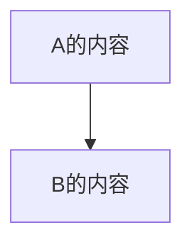
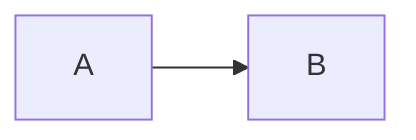
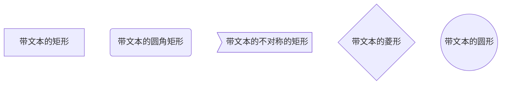
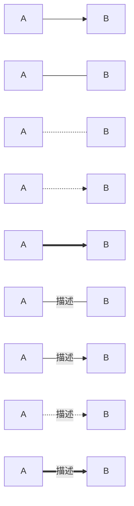
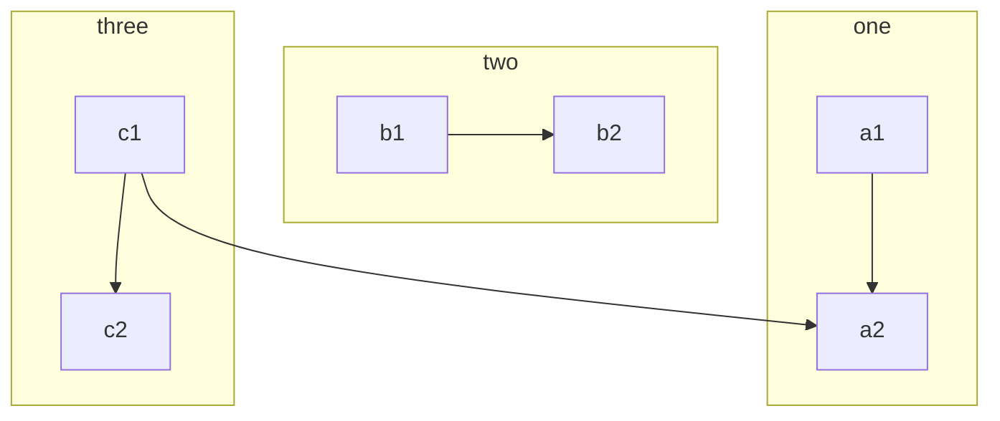
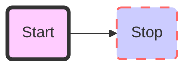
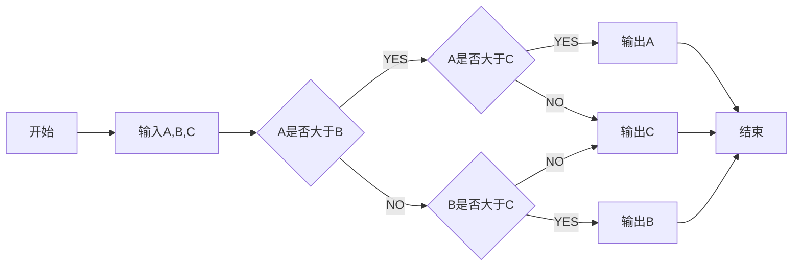
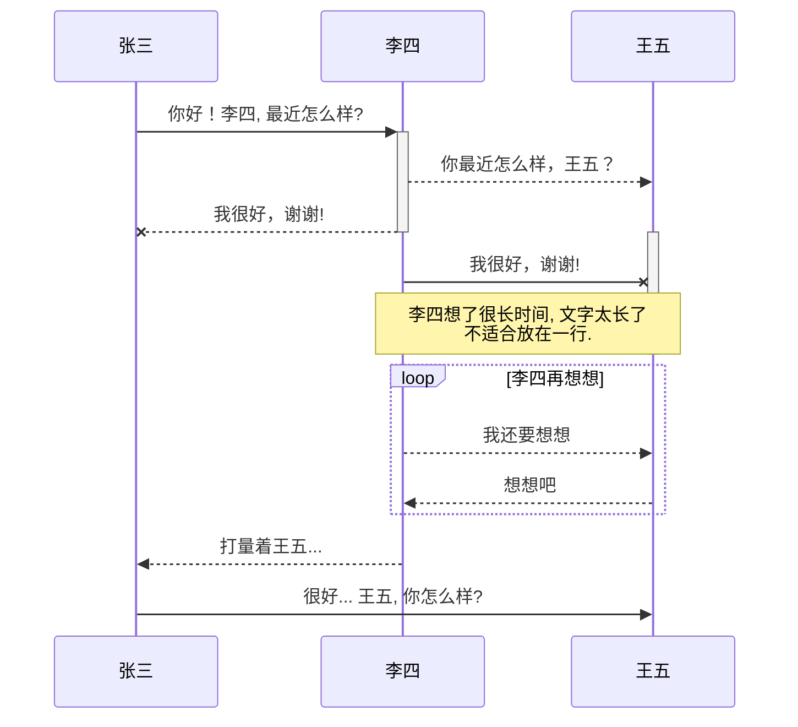

# 流程图语法 
# mermaid方式：
## 流程图方向的几个值  
* TB$\downarrow$
* BT$\uparrow$
* RL$\rightarrow$
* LR$\leftarrow$
* TD$\downarrow$  

### 效果展示: 



   
## 基本图形
* id + [文字描述]矩形
* id + (文字描述)圆角矩形
* id + >文字描述]不对称的矩形
* id + {文字描述}菱形
* id + ((文字描述))圆形

### 效果展示  


## 节点之间的链接方式  
* A --> B A带箭头指向B
* A --- B A不带箭头指向B
* A -.- B A用虚线指向B
* A -.-> B A用带箭头的虚线指向B
* A ==> B A用加粗的箭头指向B
* A -- 描述 --- B A不带箭头指向B并在中间加上文字描述
* A -- 描述 --> B A带箭头指向B并在中间加上文字描述
* A -. 描述 .-> B A用带箭头的虚线指向B并在中间加上文字描述
* A == 描述 ==> B A用加粗的箭头指向B并在中间加上文字描述

### 效果展示  

## 子流程图  


##  自定义样式  


## demo()


# flowchart方式
**总体思路**：先定义，后链接 

## 讲解  
* 语法结构 
```
	```mermaid
	flowchat
	定义节点
	连接节点
	（样式调整）
	```

```
* 节点类型 
    - 开始（椭圆形）：start
    - 结束（椭圆形）：end
    - 操作（矩形）：operation
    - 多输出操作（矩形）：parallel
    - 条件判断（菱形）：condition
    - 输入输出（平行四边形）：inputoutput  
    - 预处理/子程序（圣旨形）：subroutine

* 语法详解
    - 节点定义
    `变量名=>节点标识: 节点显示名`
    - 节点连线 
    `变量名1->变量名2->...->变量名n`
    - 关键字
        + yes/true：condition类型变量连接时，用于分别表示yes条件的流向
        + no/false：同上，表示否定条件的流向  
        + left/right：表示连线出口在节点位置（默认下面是出口，如op3），可以跟condition变量一起用：cond(yes,right)
        + path1/path2/path3：parallel变量的三个出口路径（默认下面是出口）
    - 节点状态(待了解)

## 案例
```flow

start=>start: 开始
end=>end: 结束
op=>operation: 操作
sub=>subroutine: 子程序
cond=>condition: 是（条件判断）?
cond2=>condition: 是（条件判断）?
input=>inputoutput: 输入
output=>inputoutput: 输出

start->input->op->cond
cond(yes)->end
cond(no)->cond2
cond2(yes,right)->sub
cond2(no,bottom)->output->end

```

# 时序图
## 实例



## 语法结构与详解
- 结构  

```
    ```mermaid
	    sequenceDiagram
	    participant 别名 as 对象显示名（全部直接用显示名时可以不写）
	    顺序增加图表中消息
	    （可以加入标签提示）
	```
```

- 详解
    + 消息格式:  
        `【对象1】【箭头类型】【对象2】 : 消息内容`
    + 连接样式：
        * 实线：->
        * 虚线：- ->
        * 带箭头的实线：->>
        * 带箭头的虚线：- ->>
        * 带x的实线：-x  
        * 带x的虚线：- -x  
    + 激活方块
        - 语法方式实现： 
                ```
                开始：activate 【对象】
                结束：deactivate 【对象】
            ```
        - 直接在对象前面加加减号（开始时用加号“+”，结束时用减号“-”）如后面实例中的王五
    + 循环
        ```
            loop 循环说明
            【消息流】
            end
            ```
    + 条件 
        ```
            alt 条件说明
            【消息流】
            else
            【消息流】
            end
        ```
    
        ```
            opt 条件说明
            【消息流】
            end
        ```


        + 条件的实例：


        ```mermaid
            sequenceDiagram
            participant 张 as 张三
            participant 李 as 李四
            张 ->> 李: 你好！李四, 最近怎么样?
            alt 如果感冒了
            李->> 张: 不太好，生病了。
            else 挺好的
            李->> 张: 我很好，谢谢。
            end
                opt 另外补充
                李->> 张: 谢谢问候。
            end
	    ```


