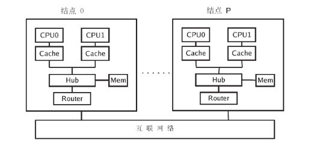
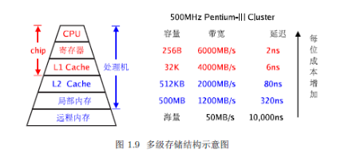
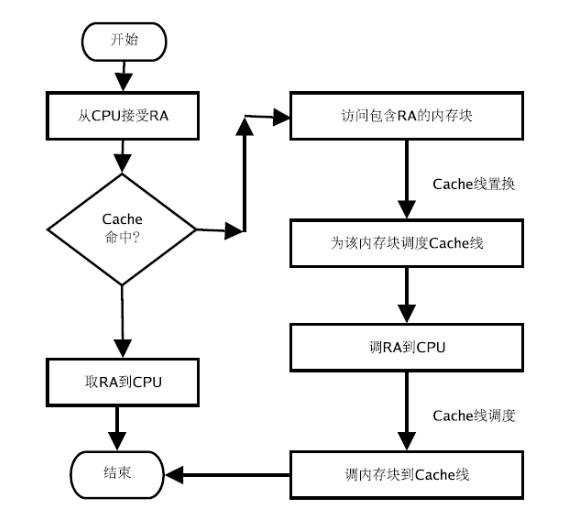
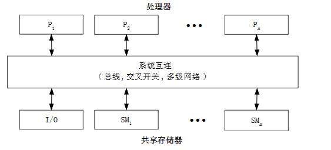
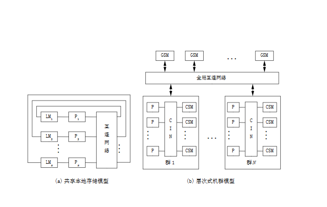

# **并行计算的概念**

## 概念：

在并行机上，将一个应用分解成多个子任务，分配给不同的处理器，各个处理器之间相互协同
并行地执行子任务，从而达到加速求解速度，或者求解应用问题规模的目的

## 必备的三个基本条件：

- 并行机。并行机至少包含两台处理机，并且处理机之间通过互联网络连接，相互通信
- 问题必须要有并行度，即问题可以分解为多个子任务，并行执行。算法的设计：将一个应用分解为多个子任务的过程
- 并行编程。在并行机提供的并行编程环境上，具体实现并行算法，编制并行程序并运行。

## 目的：

- 加速求解问题的速度
- 提高求解问题的规模

---

# **构成并行计算系统的要素**

## 组成**并行机**的三个要素

- 节点。每个节点由多个处理器构成，可直接输入输出
- 互连网络。 所有节点通过互联网络相互连接相互通信
- 内存。 由多个存储模块组成，这些模块可以与节点对称地分布在互连网络的两侧，或者位于各个节点内部

## 节点结构(内存分离模式)：

- 两个或两个以上微处理器(CPU)
- 二级高速缓存(L2 cache)
- 集线器(HUB)路由器(router)

二级高速缓存::缓存内存访问的数据，同时为CPU内的一级cache提供计算数据，以及cache为寄存
器提供数据，寄存器为逻辑运算部件提供数据

节点内部，多个微处理器通过HUB相互连接，并共享连接在集线器上的内存模块和I/O模块，路由器

处理器个数较少时，例如8–16 个以内，集线器一般采用高速全交互交叉开关，或者高带宽总线完成

处理器个数较多，例如数十个，则集线器就等同于并行机的互联网络。

---

# **体系结构-存储系统**

## 内存系统概述

内存墙问题：内存模块的访问速度与处理器执行速度不一致，处理器快，但受限于内存速度难以发挥作用

解决方法：cache系统，高速缓冲区，缓存内存模块的部分数据，尽量将对内存的访问转为对cache的访问，依次缩短访问时间

层次体系:

## CACHE应用要点

cache工作方法：~~~~~~

总之，数据在内存和cache之间的移动是以cache线为基本单位，不是以当个数据字为单位，以该数据所在的内存块为单位

cache减少访存次数的一个内在原因：程序的数据访问具有局部性，即连续数用的数据一般存储在内
存的连续位置，一次调入，随后的数据访问就可能落在cache线中，从而减少访问次数

命中率定义：一次内存访问操作，如果操作数存在于cache 中，则称该次访问是cache . 命中的，
否则，称该次操作是cache . 失效的。为了衡量cache 命中的频率，定义cache . 命中率为，程序
执行过程中，cache 命中的总次数和内存访问总次数之比值。

cache 容量不是越大越好，线的大小也不是越大越好，实际表明前者性价比不高，抬高处理器价格，后者导致线条数少，访问冲突的可能性增大

一级cache还分为两个，一个存储**指令**，一个存储**数据**

## cache的映射策略：内存块和cache线之间建立互相映射关系，是一个必要环节

分为：

- 直接映射，内存块与cache线一对一
- K-路组关联映射策略 cache分解成V个组，每个组由K条cache线组成，内存块按直接映射策略映射到某个组，但该组中，内存块可以映射到任意一条cache线
- 全关联映射策略，内存块可以被映射到cache中的任意一条cache线

## cacahe线的置换策略

对于K-路组关联映射策略，内存块请求被置入时，如何选组中的某条cache线，将其协会内存，有很多算法：

- LRU (Least Recently Used) 算法：置换没引用时间最长的cache线；
- FIFO (First Input First Output) 算法：置换最先置入的cache线；
- LFU (Least Frequently Used) 算法：置换使用频率最低的cache线；
- 随机算法：随机选择一条cache 线置换。

## cache读写策略

不论读写，两种结果：**命中** ，**缺失**
发生缺失的时候，考虑最近访问的数据被再次访问的几率较高，需采取相应的策略对数据进行存取
（空间时间局部性 O_o???）

**读命中策略**:
Cacheable：定义了Cacheable，需要从cache中读出命中的数据;
No Cacheable：不定义，直接从下级cache/主存进行数据读取;

**读缺失策略**：
Read allocate：读缺失的时候，从下级Cache/主存读回数据的同时将该缺失数据放入（Line fill）缺失Cache;
No Read allocate：读缺失的时候，直接从下级Cache/主存中读回数据，此数据不进去缺失Cache;

**写命中策略**:
Write Back(写回):在写得时候如果发生命中，那只是更新Cache之中命中的数据，不更新下级Cache/主存的数据
Write Through(写穿透):在写的时候如果发生命中，更新Cache数据的同时，也需要更新下级/主存的数据
写一次法：第一次命中时候同时更新Cache和下级的内容

**写缺失策略**

Write allocate(写分配):在发生写缺失的时候，在直接写下级Cache/主存的同时，还将该缺失数据写入本级Cache，一般与WrieBack一起使用
No Write allocate:发生写缺失时，只将数据写入下级Cache/主存，不更新缺失数据的Cache，一般与Write Through一起使用

## 替换策略

cache工作原理要求它尽量保存最新数据，必然要产生替换

对于直接映射策略的cache，只要把此特定位置上的原主板块换出cache即可
对于全相联和组相联cache来说，就要从允许存放新主存块的若干特定行中选取一行换出

write back下的替换是替换dirty的数据（被修改过的）

常见替换算法：
最不经常使用(LFU)算法：将一段时间内被访问次数最少的那行数据换出
近期最少使用(LRU)算法：近期内长久未被访问过的行换出
随机替换算法：从特定的行位置中随机地选取一行换出。（硬件上容易实现，速度也比前两个快，但是会及降低命中率和cache工作效率

# cache数据的一致性策略

为了保持计算结果的正确性，必须设计某种策略，保持cache 数据和内存数据的一致性

Write–through 策略：cache 线中的数据一旦被修改，则立即写入内存块。它的缺点是，增加了许多不必要的内存访问。
Write–back 策略：当且仅当要求进行cache 线置换时，或者有外部请求访问内存块时，将cache 线的数据写入内存。

# **体系结构-访存模型**

## 存储方式：

- 共享内存  处理单元通过对共享内存的访问来交换信息协调各处理器对并行任务的处理
- 分布式内存    各个处理单元拥有独立的局部存储器，处理器之间通过消息传递来交换信息，协调和控制各个处理器的执行
- 分布式共享内存    结合前两者特点（但具体不清楚 O_o?

## 均匀访存模型

内存模块与结点分离，分别位于互联网络的两侧，互联网络一般采用系统总线、交叉开关或多级网
络，称之为紧耦合系统（tightly coupled system）

工作流程示意图:

特点：

- 物理存储器被所有结点共享；
- 所有结点访问任意存储单元的时间相同；
- 发生访存竞争时，仲裁策略平等对待每个结点，即每个结点机会均等；
- 各结点的CPU 可带有局部私有高速缓存（cache）；
- 外围I/O 设备也可以共享，且每个结点有平等的访问权利

结构：

## 非均匀访存模型

内存模块局部在各个结点内部，所有局部内存模块构成并行机的全局内存模块（即本章第一个示意图
物理上分布，逻辑上全局共享，所以非均匀访存模型也可称为分布共享访存模型

结构示意图:

特点:

- 物理存储器被所有结点共享，任意结点可以直接访问任意内存模块；
- 结点访问内存模块的速度不同：访问本地存储模块的速度一般是访问其他结点内存模块的3 倍以上；
- 发生访存竞争时，仲裁策略对结点可能是不等价的；
- 各结点的CPU 可带有局部私有高速缓存（cache）；
- 外围I/O 设备也可以共享，但对各结点是不等价的

## 分布式访存模型:

特点:
该模型的内存模块的物理分布类似于非均匀访存模型但与非均匀访存模型不同的是，各个结点的存
储模块只能被局部 CPU 访问，对其他结点的内存访问只能通过消息传递程序设计来实现，一般地，
每个结点均是一台由处理器、存储器、I/O设备组成的计算机
