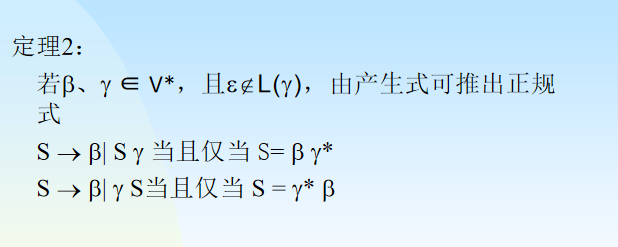
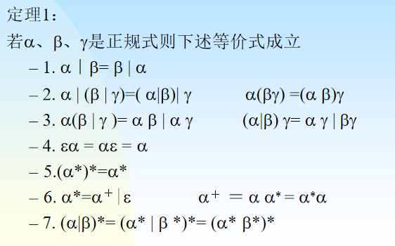

#  文法

概念：描述语言的语法结构的形式规则

相关概念：
- 非终结符：出现在规则的左部，用<>， 非终结符集合用$V_N$表示
- 终结符：语言中不可再分割的字符串 ，终结符集合用$V_T$表示
- 开始符号：表示所定义的语法范畴的非终结符，又称识别符号
- 产生式： 用来定义符号串之间的关系的一组规则 形式为：A->a(A产生a)

文法G是一个四元式$(V_N,V_T,P,S)$
根据对产生式施加的限制，可分为:
- 0型文法
- 1型文法
- 2型文法
- 3型文法

## 0型文法（短语文法或无限制文法）

任一产生式都有一般形式$\alpha \rightarrow \beta,\alpha \in V^+,\beta \in V^*$，且对$\alpha \beta$不加限制
也叫短语结构文法，记为PSG
短语结构语言
可由图灵机识别

## 1型文法

对于$\forall \alpha \rightarrow \beta \in P$,均有$|\alpha|\leq |\beta|$，成立$\alpha \beta \in V^+$
上下文有关语言
可由线性限界自动机识别

## 2型文法

在1型文法的条件上：且$\alpha \in V，\beta \in V^+$
上下文无关语言
可由下推自动机识别

## 3型文法:
若2型文法G中仅含有形如:$A\rightarrow aB,A\rightarrow a$,其中$AB\in V,a\in T$

正则语言或者正规语言，可由**有限自动机**识别
正规语言可由正规表达式表示
右线性文法:3型文法G中仅含形如$A \rightarrow aB,A\rightarrow a$的产生式
左线性文法:3型文法G中仅含形如$A \rightarrow Ba,A\rightarrow a$的产生式

若一个文法既含有左线性又含有右线性表达式，它不一定是3型文法。

四种文法之间的关系是逐级包含关系。是0肯定是1，是1肯定是2，2肯定是3

## 正规式的等价式

# 正规式，DFA，正规文法的转换

[正规文法与正规式转换](https://blog.csdn.net/qq_43543789/article/details/105262748)

其他的均在之前提到过
