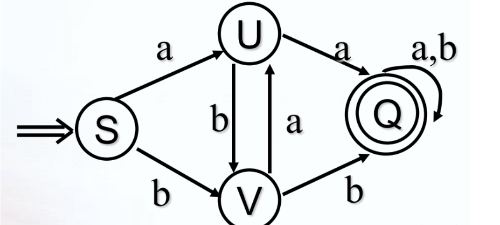
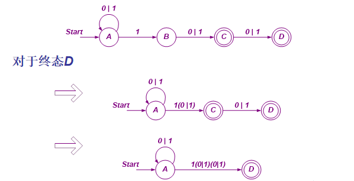
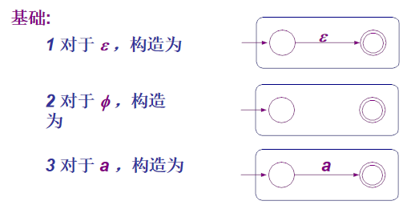
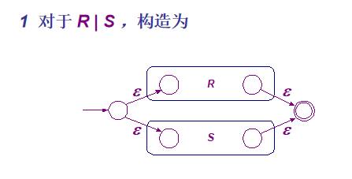

# 有穷自动机

有穷自动机分为DFA和NFA两种。分别为确定和不确定的两种形式.

## DFA

一个确定的有穷自动机是一个五元组:

$$
M=(K,\sum , f,S,Z)
$$

各自的意义如下:
$K$:是一个有穷集合，每个元素代表一种状态

$\sum$:是一个有穷字母表，每个元素称为一个输入符号，所以也称其为输入符号表

$f$:是转换函数,是$K\times \sum \rightarrow K$上的映像

> 例如：$f(k_i,a)=k_j(k_i\in K,k_j\in K)$,理解成状态之间通过输入符号的转换

$S$:唯一一个初态,$S\in K$

$Z$:终止状态**集**,也称为接收状态或结束状态,$Z\subseteq K$

**DFA的状态转换图**:
M 含有 m 个状态， n 个输入字符
则状态转换 图有 m 个结点，每个结点至多有 n 条箭弧射出
每条箭弧用 Σ 中一 个不同的输入字符做标记

例如：
对于DFA M=( K, Σ, f , S, Z ) = ( {S, U, V, Q}, {a,b}, f , S, {Q})
f (S,a) = U   f (S,b) = V   f (U,a) = Q   f (U,b) = V   f (V,a) = U   f (V,b) = Q   f (Q,a) = Q   f (Q,b) = Q

其状态转换图如下:

初始状态为双箭头，终止状态是双圈

**DFA的特点**

- 初态唯一
- 输入字符不包括$\varepsilon$(空串)
- 有向边上只有一个字符
- 一个状态对于某个字符，最多只有一条出边,即转换函数值为单一状态

DFA的可识别空串:
对 ∑ * 中任意符号串 t ，若存在从初态到某一终态的 通路，且通路上所有弧标记符连接成的字于
t ，则称 t 可为 DFA 所识别 ( 读出或接受 ) 。

## NFA:

一个不确定的有穷自动机也是一个五元组:

$$
M=(K,\sum , f,S,Z)
$$

$K$:是一个有穷集合，每个元素代表一种状态

$\sum$:是一个有穷字母表，每个元素称为一个输入符号，所以也称其为输入符号表

$f$:是转换函数,是$K\times \sum \rightarrow K$的全体子集映射

$S$:非空初始状态集,$S\in K$

$Z$:终止状态**集**,$Z\subseteq K$，**可为空集**

**NFA的特点**:

- 初态不唯一
- 输入字符包括$\varepsilon$
- 有向边上可以为字符串
- 一个状态对于某个字符，有多条输出边，即转换函数值是一个状态集合，而不是单一的状态

## DFA与NFA的关系

> DFA是NFA的特例

**有穷自动机的等价性**
对于每个NFA M，存在一个DFA M’使得 L(M)=L(M’)
对于任何两个有穷自动机，如果L(M)=L(M’)， 则称M与M‘是等价的

**NFA的确定方法**:

假设输入字符集$Z={a,b}$

子集法(主要用于计算机)

1. 设置三列:$I,I_a,I_b$
2. 第一行，求初始状态对空串的推到得到字符集1，写入第一列，求对1输入空串,a的推到得到子集写入第二列,求1对输入空串,b的推到得到1’,写入第三列
3. 第三行，观察1’是否与第一列有重复，重复跳过，不重复写入第二行第一列，重新记作字符集2，重复与第一行一样的过程

... 持续推导，直到无法产生新的字符集

造表法(手算用)

1. 将NFA的转换图转换成状态矩阵
2. 对原有状态图进行重新标记（作业写法

**闭包的定义**

状态q的$\varepsilon$-闭包 记为 **ECLOSE(q)**,为q经所有$\varepsilon$路径可以到达的状态(可以为0个)

**从DFA构造等价的$\varepsilon$-NFA**

**从$\varepsilon$-NFA构造等价的DFA(修改的子集构造法)**
（和普通的nfa确定化一样的道理

## 正规式

三种代数运算:

- 联合
- 连接
- (*)闭包

优先级 : *>.>|

**从有限自动机构造等价的正规表达式**

中间状态消去法:

对于一个箭头，多个输入转化成联合，指向本身的转闭包
对于两个路径，直接合并
例子：

1. **从正规表达式构造等价的$\varepsilon-NFA$**

对于NFA,DFA,正规式之间的转化问题，多为：
- NFA-->DFA(上面已经提过)
- 正规式-->NFA
- 正规式子-->DFA
- NFA-->正规式
- DFA-->正规式（与第四个差不多

[参考链接](https://blog.csdn.net/weixin_51995229/article/details/128429776)
总之多练(:)

## DFA的最小化
可区分：对于任何两个状态t和s，接受输入字符串w，从t和s除法到达不同的接受状态，则称对t和s
是可区分的

不可区分：与可区分相反，接受一个字符串，到达的状态不同

步骤:
- 划分终态和非终态
- 对于每个状态集合去输入不同的字符串，得到结果仍在一个集合内的可区分，不在的分开
- 划分到不可划分

