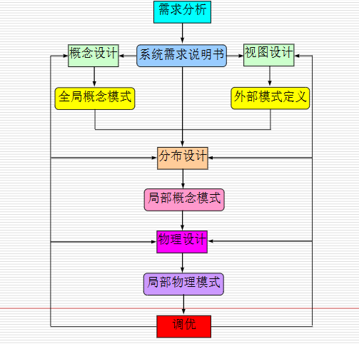
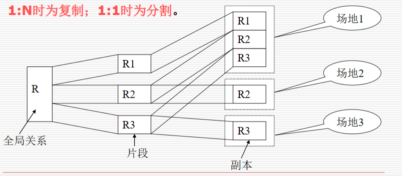
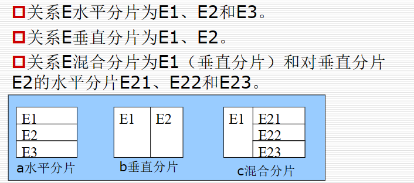
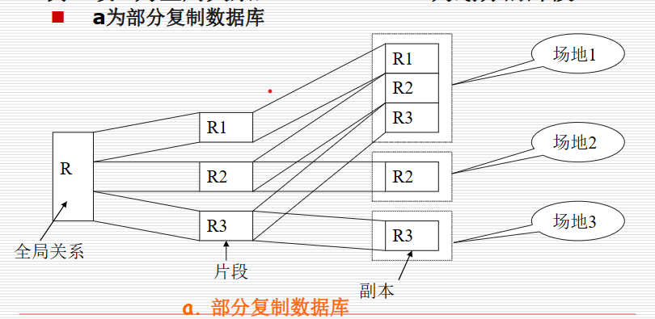
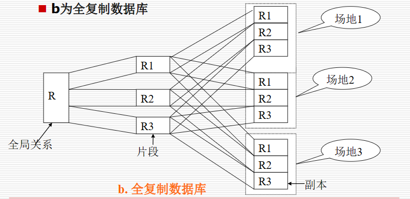
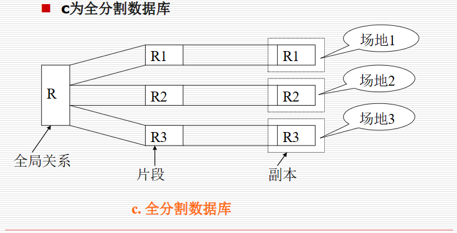
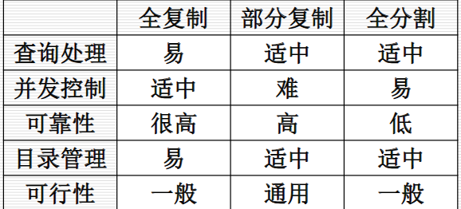

# 两种设计策略

## top-down
基于五步实现
1. 需求分析
2. 概念设计，试图设计
3. 分布设计，数据分片和分配
4. 物理设计
5. 性能调优

示意图:

# 分片的定义:

- 片段:是分布式数据库中数据的存储单位
- 分片:对全局数据的划分，划分的结果称为片段
- 分配:对片段存储场地的指定，称为分配.当片段存储在一个以上场地时，称为数据复制存储。如果每个片段只存储在一个场地，称为数据分割存储

分片的作用:
- 减少网络传输量
- 增大事务处理的局部性
- 提高数据的可用性和查询效率
- 使负载均衡

分片设计工程
分片过程是将全局数据进行逻辑划分和实际物理分配的过程。全局数据由分片模式定义分成各个片段数据，各个片段数据由分配模式定义存储在各场地上。

**分片模式**:定义从全局模式到片段模式的映射关系
**分配模式**:定义从片段模式到物理模式的映射关系

1:N时为复制；1:1时为分割

分片设计过程的示意图:

分片的原则:
- 完备性：所有全局数据必须映射到某个片段上。
- 可重构性：所有片段必须可以重新构成全局数据。
- 不相交性：水平划分的各片段所包含的数据不允许相同

分片的种类:
- 水平分片：按元组进行划分，由分片条件决定。
- 垂直分片：按关系属性划分，除关键字外，其他属性不允许出现在多个分片中。
- 混合分片：即包括水平分片也包括垂直分片。

分片相关的透明性:
- 透明性：指对用户和高层系统隐蔽具体实现细节。包括：分片透明性、分配透明性和局部映射透明性。
- 分片透明性：用户不必考虑数据属于哪个片段。
- 分配透明性：用户不必考虑各个片段的存储场地。
- 局部映射透明性：用户不必考虑数据的局部存储形式。

# 水平分片的设计
定义:将关系的元组集划分成若干不相交的子集。每个水平片段由关系中的某个属性上的条件来定义，该属性称为分片属性,该条件称为分片条件

~~人话版本:~~用固定数目的属性将数据分为不相交的子集

要满足分片的原则

水平分片是基于谓词条件划分关系

分片需求信息:来源于应用信息和数据库信息:
应用信息:包括定性的信息和定量的信息
数据库信息：主要指全局模式中模式间的关联关系(用于导出水平分片)

定性信息:查询中的谓词。分为：
简单谓词：**只包含一个操作符号的查询谓词**
小项谓词：由多个简单谓词组成的查询谓词

定量信息:
小项选择度-sel($m_i$)指关系R中满足小项谓词$m_i$的元组的比率
小项访问频率-acc($m_i$)指在一定时间段内对应小项谓词对应的分段fi记录被查询的数量

## 基本的水平分片
第一步：找到具有完备性和最小性的简单谓词集合
第二步：派生小项谓词集合
第三步：确定有意义的小项谓词集，去除无意义的小项谓词。

**完备性**
简单谓词集合Pr是完备的，当且仅当：任何应用程序访问基于Pr定义的小项进行分片的任何片段中不同元组的机率均等。
**最小性**
如果简单谓词集中所有简单谓词都是相关（relevant）的，则该简单谓词集具有最小性（简单谓词应该与决定分片相关

## 导出水平分片
定义:一个关系的分片不是基于关系本身的属性，而是根据另一个与其有关联的关系的属性来划分，这种划分为导出水平划分
如果一个关系的水平分片的分片属性属于另一个关系，则该分片称为另一个关系的导出分片

~~人话版本~~:根据两种属性的关系进行的划分

# 垂直分片的设计
定义：垂直分片是将一个关系按属性集合分成不相交的子集（主关键字除外），属性集合称为分片属性。即垂直分片是将关系按列纵向以属性组划分成若干片段

理解成用竖线切开

正确性检验:
垂直分片的正确性检验同水平分片正确性检验一样。
垂直分片也应满足**完备性**、**可重构性**和**不相交性**

影响垂直分片设计的因素:

应用需求:同一垂直片段中的多个属性通常是被同一应用同时访问(理解简单)

## 混合分片
混合分片是既包括水平分片，又包括垂直分片的分片过

# 分片的表示方法:

图形表示法

分片树表示法
定义：一个分片树由以下几部分组成：
- 根节点表示全局关系；
- 叶子节点表示最后得到的片段；
- 中间节点表示分片过程的中间结果；
- 边表示分片，并用h（水平）和v（垂直）表示分片类型
- 节点名表示全局关系名和片段名

# 分配设计:
定义：全局数据经过分片设计，得到各个划分的片段，片段到物理场地的存储映射过程称为分配设计

分配类型:
- 非复制分配：每个片段只存储在一个场地上，称为分割式分布，对应的分布库，称为全分割式分布库
- 复制分配：
    + 如果每个片段在每个场地上存有副本，称为全复制分配，对应的分布库称为全复制分布库。
    + 如果每个片段只在部分场地上存有副本，称为部分复制分配，对应的分布库称为部分复制分布库。

看图理解

优缺点对比:

# 数据复制技术

数据复制优势:
- 减少网络负载。就近访问，减少网络传输代价。
- 提高系统性能。利用本地资源，并行处理。
- 更好地均衡负载。负载分布到多个节点。

根据更新传播方式不同：同步和异步复制
同步复制方法是指所有场地上的副本总是具有一致性
分析：保证副本数据一致性，但操作繁琐，冲突会增加，响应时间慢
异步复制方法是指各场地上的副本不要求实时一致性，允许在一定时间内是不一致的
分析：降低冲突。缩短相应时间，提高效率，但同步性降低，事务回滚代价高

根据参与复制的节点间的关系不同:主从和对等复制

主从复制也称单向复制。主场地上的副本称为主副本，从场地上的副本称为从副本。更新操作只能在主场地上进行，并同步到从场地的从副本上。
分析：易于维护一致性，但是降低了系统的自治性

对等式复制也称双向复制。各个场地的地位是平等的，可修改任何副本。被修改的副本临时转换为主副本，其它为从副本。主副本所在场地为协调场地，协调同步所有从场地上的从副本。

分析：自治性高，可用性好，但会引起冲突，处理复杂，开销大

## 复制的常用方法:
- 基于触发器法
- 基于日志法
- 基于时间戳法
- 基于API法