# 物理结构和逻辑结构

物理结构:
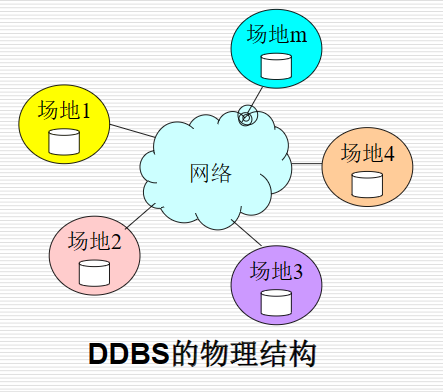
逻辑结构:
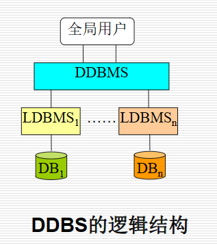

解释:
DDBMS:分布式数据库管理系统
LDBMS:局部的局部场地上的数据库管理系统

# 体系结构

系统的体系结构: 指按组件，组件功能以及它们的交互作用定义系统的结构

基于层次的DBMS体系结构:
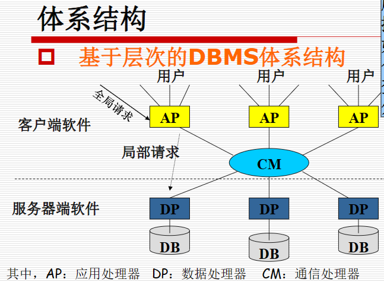

AP:用于完成分布数据处理的软件
DP:负责进行数据管理的软件 ~=数据库管理系统
CM:负责命令和数据的传输通信

不同系统的系统结构:(依据客户和服务器的数量来分)

- 1对1 :单个客户对应单个服务器数据
- 1对多:单个客户对应多个服务器数据
- 多对1:多个客户对应单个服务器数据
- 多对多:多个客户对应多个服务器数据

基于"中间件"的客户/服务器的体系结构:
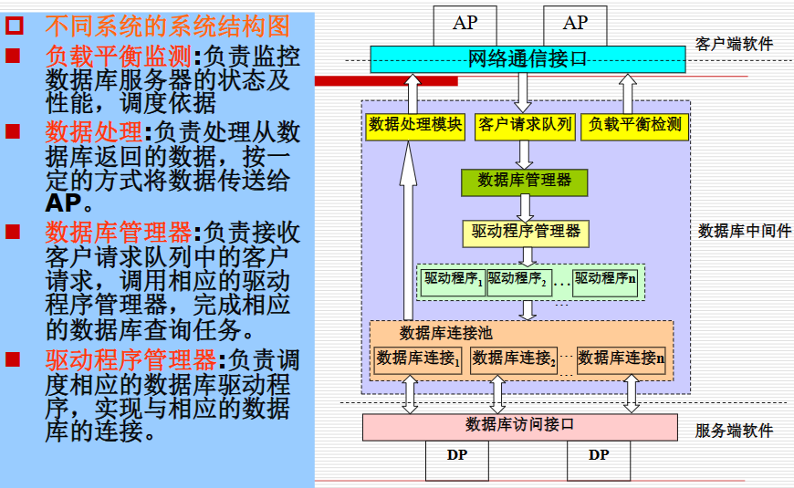

# DP与AP的组件结构介绍:

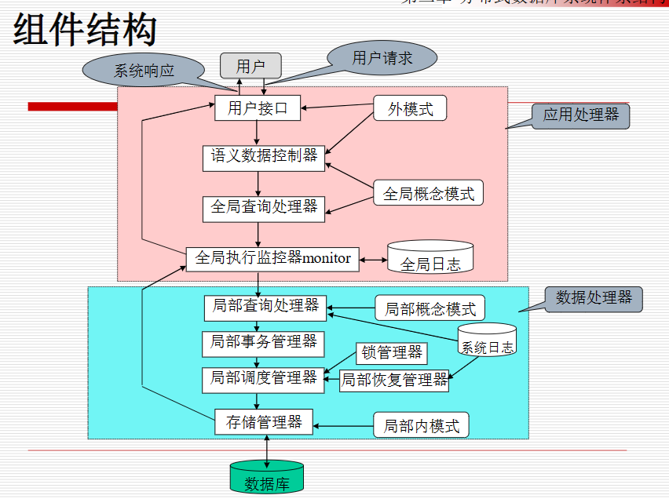

对于AP:

| 名称           | 功能                                                                             |
| -------------- | -------------------------------------------------------------------------------- |
| 用户接口       | 检查用户身份，接受用户命令(SQL)                                                  |
| 语义数据控制器 | 视图管理，安全控制，语义完整性控制(全局概念模式)。这些约束定义在字典中           |
| 全局查询处理器 | 将用户命令翻译成数据库命令;生成全局查询的分布执行计划;收集局部执行结果返回给用户 |
| 全局执行监控器 | 调度协调和监视AP和DP之间的分布执行；保证复制数据的一致性；保证全局事务的原子性   |

对于DP：

| 名称           | 功能                                                                                           |
| -------------- | ---------------------------------------------------------------------------------------------- |
| 局部查询处理   | 实现全局命令到局部命令的转换；访问路径选择器，选择最好的路径执行                               |
| 局部恢复管理器 | 维护本地数据库一致性的故障恢复。                                                               |
| 局部事务管理器 | 以局部子事务为单位调度执行，保证子事务执行的正确性。                                           |
| 局部调度管理器 | 负责局部场地上的并发控制，按可串行化调度和执行数据操作                                         |
| 存储管理器     | 按**调度命令**访问数据库；控制数据库缓存管理器；返回局部执行结果；保证子事务执行的正确性 |

# 模式结构

**抽象为四层的模式结构**:

- 全局外层
- 全局概念层
- 局部概念层
- 局部内层

模式与模式之间是映射关系

介绍图:
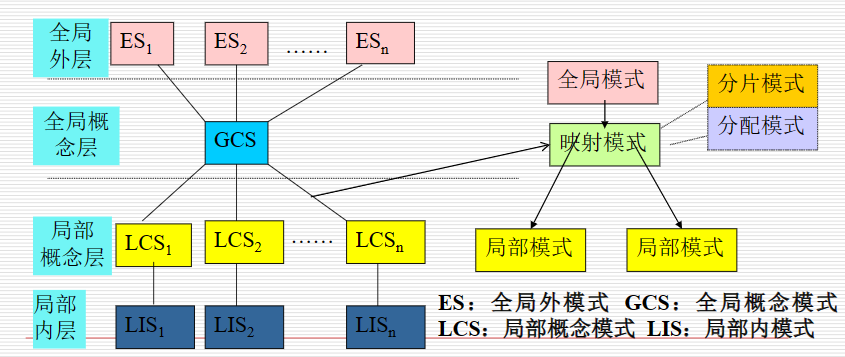

ES:全局用户试图，是全局用户对分布式数据库的最高层抽象。全局用户使用视图，不必关心数据分片和具体的物理分配细节

GCS:全局概念视图,是分布式数据库的整体抽象，包含了全部数据特性和逻辑结构，是对数据库全体的描述

全局概念模式经过**分片模式**和**分配模式**映射到**局部模式**

- 分片模式：描述全局数据的逻辑划分视图。即全局数据逻辑结构根据条件的划分为局部逻辑结构，每一个逻辑划分形成一个分片。关系数据库中，一个关系中的一个子关系称该关系的一个片段
- 分配模式：描述局部数据逻辑的局部物理机构，即划分后的分片的物理分配视图

LCS：局部概念视图，是全局概念模式的子集，描述局部场地上的局部数据特征和逻辑结构后.全局数据模型与局部数据模型不同时，还涉及数据模型转换等内容

局部内模式:定义局部物理视图，是对物理数据库的描述，类似集中数据库的内层

**全局数据库到局部数据库 1:N映射**

# 多数据库集成系统

通常数据库系统时自上而下的设计数据可(参考上面的描述，都是自上而下)

而数据库集成系统通过约束系统管理能力(只支持只读),可将数据库成员扩展到鼠标个,在数据库
集成系统中，通常数据和数据库已存在，是遵循自下而上地集成各局部场地上的数据

参考图:
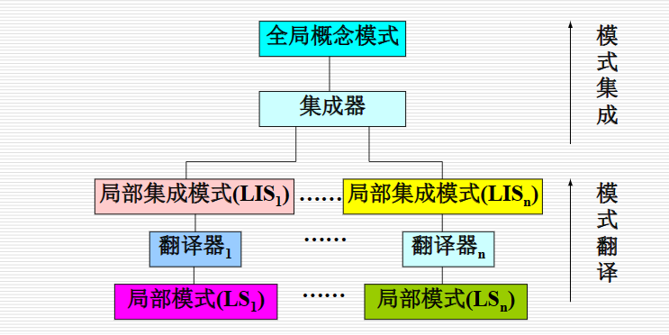

**多数据库系统(MDB)**:
mdbs是在已存在地数据库系统(称为局部数据库系统LDBs)之上为用户提供一个统一地存取数据地环境

逻辑结构图:
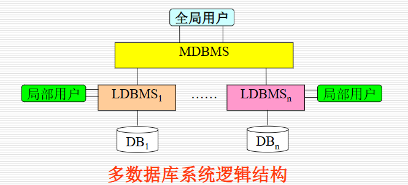

**可理解成将多各单数据库系统的全局概念视图变成局部概念视图，并再往上抽象成一个新的全局概念视图，并形成新的全局用户视图，即多数据库系统**

原理图:(参考上面这句话理解
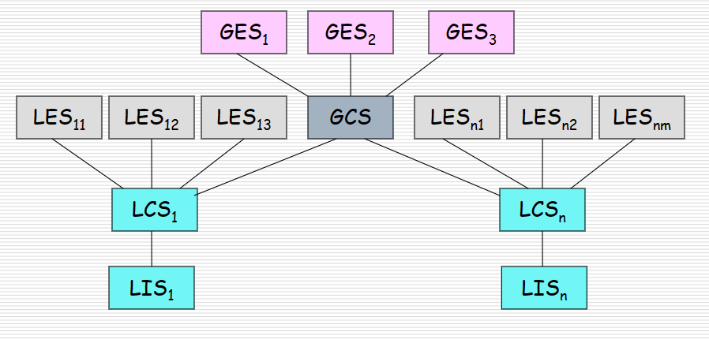
当然也可以去掉全局概念，直接由局部概念模式组合抽象成全局用户视图
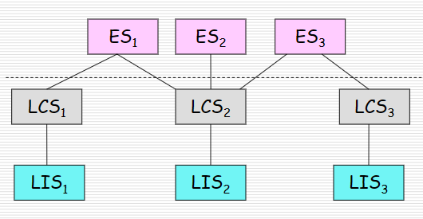

# P2P数据库系统(P2PDBS)

对等型模型(P2P模型)是一种新型的体系结构模型，面向大范围的多数据资源点的松散耦合

特点:

- 每个点均可贡献数据，系统资源具有丰富性，多样性
- 可直接访问数据源中的数据资源，及时得到最新的数据
- 采用自组织原则，健壮性(O_o>?)
- 每个点可随时加入和退出，系统具有分散性，可扩展性
- 以Web上的资源为Peer点，系统部署简单，不需要复杂的框架部署实现。

与DDBS的典型区别：

| P2PDBS                         | DDBS                       |
| ------------------------------ | -------------------------- |
| 节点随时加入和离开             | 节点受控加入和退出         |
| 没有预定的全局模式             | 共享的模式                 |
| 不能检索到满足查询的全部回答   | 检索到满足查询的全部回答   |
| 将查询转发到邻居，逐步定位内容 | 知道可回答查询的节点的位置 |
| 扩展性主要解决参加的主机数     | 扩展性主要指存储的数据规模 |

# 分部式数据库系统分类

采用分布式数据库的按个特性：分布性，异构性，自治性 组成的三维空间图来描述类型:

- **分布性**:指系统的各组成单元是否位于同一场地上。分布式数据库系统是物理上分散、逻辑上统一的系统，即具有分布性
- **异构性**:指系统的各组成单元是否相同，不同为异构，相同为同构

  + 数据异构性:数据在格式，语法，语义上存在不同
  + 数据系统异构性：指各个场地上的局部数据库系统是否相同
  + 平台异构性：计算机系统是否相同
- **自治性**:指每个场地的独立自主能力。自治性通常由设计自治性、通讯自治性和执行自治性三方面来描述。

# 字典信息的组织

**数据库系统采用数据字典存储数据库定义，管理等信息**
分为**全局字典**和**局部字典**
组织方式分两种：**集中式字典**，**分布式字典**

**集中式字典**：
系统中的字典信息集中存储在一个场地上，进行统一管理。
集中式字典维护方便，但会成为系统性能的瓶颈

**分布式字典**
是将字典中的信息分布在多个场地上存放。
分布式字典又分**复制式分布**和**非复制式分布**（有没有备份的区别
复制式分布是局部字典在多个场地上存在副本。
非复制式分布是指全局字典被分散存储在多个场地上，但每个局部字典必保存仅保存在一个场地上。

# 分布式大数据管理系统（浅浅介绍

两种体系结构:
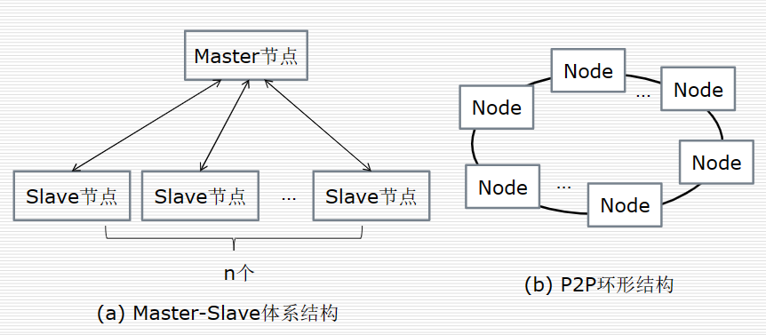

优势对比：

| M/S                                                                       | P2P                                                          |
| ------------------------------------------------------------------------- | ------------------------------------------------------------ |
| 设计简单，可控性好，但master中心节点易成为瓶颈                            | 无中心节点，自协调性好，扩展方便，可控性较差，且系统设计复杂 |
| 需要维护master服务节点，由master节点维护其管理的slave节点，维护简单、方便 | P2P环形结构的系统，自协调维护网络，扩展方便，可扩展性好；    |
| 将master节点和slave节点的功能分开，可减轻节点的功能负载；                 | 各节点平等，没有起到功能分布的作用；                         |
| 通常基于水平分片的思想实现数据分布，方便支持范围查询；                    | 适于基于Hash分布数据，负载均衡性好，但不利于支持范围查询     |
