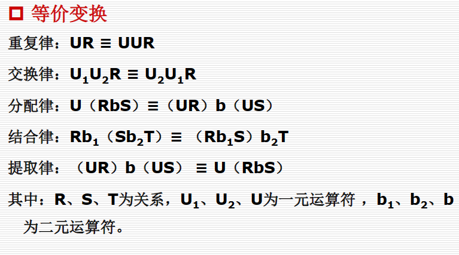
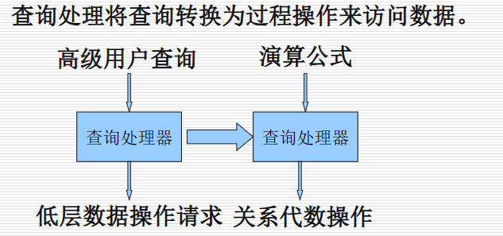
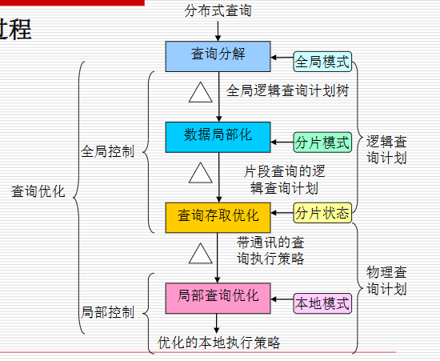
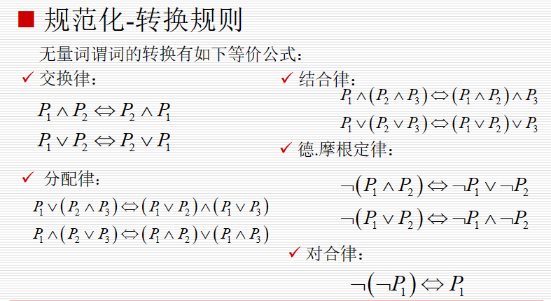
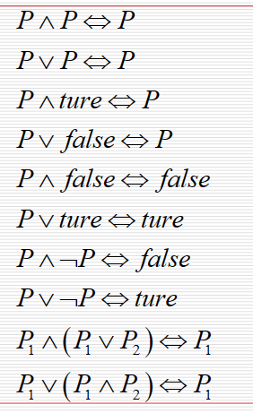

分布查询处理和优化

# 查询优化基础

**优化**:优化就是寻找执行代价（费用和时间）最小的查询执行策略，使系统执行效率降到最低
**优化目标**:指局部执行代价和网络传输代价的和最小

局部执行代价：主要指输入/输出次数及CPU处理代价
网络传输代价：主要指传输启动代价和数据传输代价

代价计算：~~阿巴阿巴~~

优化内容体现如下几点:
- 执行运算的次序
- 执行每种运算的方法
- 所访问的副本场地
- 执行运算的场地的选择

关系代数的等价变换
二元运算有联接，笛卡尔积，并，交，差，半联接
一元运算有选择，投影

查询树:叶子表示关系，中间节点表示运算，前序遍历表示运算次序

# 查询处理器概述

查询优化就是确定出一种执行代价最小的查询执行策略或寻找相对较优的操作执行步骤。

分布查询处理器需要处理查询分解和数据局部化

优化时机：
静态的 在查询编译时进行优化，基于统计信息进行穷举优化

动态的 在执行中优化，准确性好，但每次执行都进行优化，代价高

二者结合

- 全局查询存取优化 找接近于最优的执行策略,找片段查询中最佳的操作顺序，包括通信操作;
- 局部查询优化
# 查询分解

**规范化**
AND形式或OR形式

**分析**
拒绝类型不正确或语义不正确的查询

检查方法: 查询图，连接图
一个点表示结果关系，其它点表示操作关系
边分为两类若边的两点都不是结果，则该类边表示连接(join)若边的一个点为结果点，则该边为投影(projection)

当一个或者更多的子图与包含结果关系的图是不连通时，认为是语义不正确的

**约简**

规则:

**查询重写**
直接将关系演算转换为关系代数
重写关系代数查询以提高性能

通常用操作树来表示关系代数查询
根节点表示查询结果
叶子节点表示关系
非叶子节点表示中间结果关系
叶子到根的边表示序列操作
# 数据本地化
概念：全局查询到片段查询的变换
即利用全局关系与其片段关系的等价变换，将分布查询中的全局关系替换为对片段关系的查询，变换后的查询称为片段查询。对应于片段查询的查询树，称为片段查询树

全局关系R的水平分片R1,R2,R3...定义为:R=R1UR2UR3..
垂直分片:R=R1联接R2...

片段查询树的生成步骤
1. 将分片树的h（水平）节点转换为查询树的∪（并集）节点。
2. 将分片树的v（垂直）节点转换为查询树的∞（联接）节点。
3. 用替换后的分片树代替全局查询树中的全局关系，得到片段查询树

# 片段查询的优化

优化规则:
- 对于一元运算，根据一元运算的重复律，将叶子节点之前的选择运算作用于片段，如果不满足片段的限定条件，则置为空关系
- 对于联接运算的树，若联接条件不满足，则将其置为空关系
- 在查询树中，将联接运算（∞）下移到并运算（∪）之前执行
- 消去不影响查询运算的垂直片段
# 大数据库的查询处理及优化

查询处理方法:
- 键值型数据库的查询处理 
- 列存储数据库查询处理  以列为核心存储，具有相同列属性的数据集存储在一个页面或数据块中，快速响应以列为主的查询
- 文档数据库查询处理

（大话